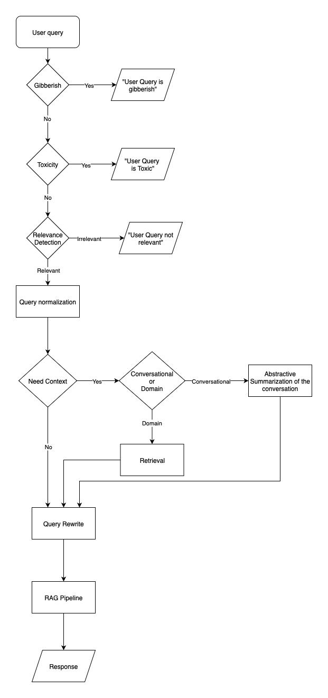

# Guardrails — Query Transformation Pipeline

A guardrails pipeline that validates, normalizes, and rewrites user queries before feeding them to a RAG (Retrieval-Augmented Generation) system. It processes each query through multiple stages: validation (gibberish, toxicity), normalization, relevance checking, context detection, optional contextual retrieval/rewriting, and finally RAG-based response generation.

## Overview

The pipeline is implemented in **`src/guardrails/guardrails_pipeline.py`**. It orchestrates:

1. **Guardrails** — Gibberish and toxicity detection  
2. **Relevance** — Ensures the query is in scope (e.g., animal wisdom)  
3. **Normalization** — Spelling and grammar correction  
4. **Context detection** — Decides if conversation history or domain retrieval is needed  
5. **Contextual retrieval & rewriting** — Summarizes conversation or retrieves from a vector store and rewrites the query with that context  
6. **RAG** — Uses the rewritten (or normalized) query to generate a response and stores the exchange in SQLite  

The design is modular: each stage is independently testable and replaceable, with fallbacks and configurable thresholds.



---

## Pipeline Flow

```
User query
    → Gibberish check (reject if gibberish)
    → Toxicity check (reject if toxic)
    → Relevance check (reject if out-of-domain)
    → Normalize (spelling + grammar)
    → Context detection (CONVERSATIONAL | DOMAIN | NONE)
    → If CONVERSATIONAL: summarize conversation → rewrite query with summary
    → If DOMAIN: vector search on corpus → rewrite query with retrievals
    → RAG(final_query) → response
    → Store (user_query, response) in SQLite
```

**Flow summary:** (1) Input validation (gibberish, toxicity) → (2) Query normalization (two-stage spelling and grammar, with Ollama LLM support) → (3) Relevance check → (4) Context assessment → (5) Context retrieval (conversation summary or domain retrieval) → (6) Query rewriting → (7) RAG processing → (8) Storage in SQLite for future context.

### Main processing loop (conceptual)

```python
while True:
    user_query = input("You: ").strip()
    if is_gibberish(user_query): continue
    if is_toxic(user_query): continue
    if not is_relevant(user_query): continue
    normalized = normalize_query(user_query)
    need_context, context_type = needs_contextualization(normalized)
    final_query = normalized
    if need_context:
        if context_type == ContextType.CONVERSATIONAL:
            summary = abstractive_summarize_conversation()
            final_query = rewrite_query_with_context(query=final_query, summary=summary)
        else:
            retrieved = retrieve_with_vector_search(normalized)
            final_query = rewrite_query_with_context(query=final_query, retrievals=retrieved)
    rag_result = animals.rag(final_query, response_type="simple")
    # ... store (user_query, response) in DB
```

### Key design principles

- **Modular architecture** — Each component is independently testable and replaceable.  
- **Progressive enhancement** — Each stage builds on the previous one.  
- **Fallback mechanisms** — Multiple methods per stage (e.g. Ollama LLM as advanced fallback for normalization).  
- **Context awareness** — Conversation history and domain retrieval feed into rewriting.  
- **Error handling** — Graceful degradation when components fail.  
- **Configurability** — Adjustable thresholds and parameters throughout.  
- **LLM integration** — Ollama used for context detection, summarization, normalization, and rewriting.

---

## Pipeline Stages (Detail)

### 1. Initialization and shared components

The pipeline uses **pathlib**, **sqlite3**, and **rich** for paths, DB, and formatted terminal output. Shared RAG infrastructure:

- **Vector DB:** `EmbeddedVectorDB()` (Qdrant)
- **Embedder:** `SimpleTextEmbedder(model_name="sentence-transformers/all-MiniLM-L6-v2")`
- **Animals corpus:** `Animals(vector_db=vector_db, embedder=embedder)` from rag-to-riches

### 2. Gibberish detection

**GibberishGuardrail** (gibberish_detector):

- **spaCy** (`en_core_web_sm`) — tokenization and out-of-vocabulary detection  
- **wordfreq** — Zipf frequency scores for rare/artificial words  
- **Shannon entropy** — character-level randomness  
- **Pattern matching** — keyboard smashes, consonant clusters  
- **Weighted scoring** — configurable weights across features  

### 3. Toxicity detection

**ToxicityGuardrail** (toxicity_detector):

- **Detoxify** — "original" pre-trained model for toxicity assessment  
- **Word list** — curated profanity list with regex word-boundary checks  
- **Configurable thresholds** for sensitivity  

### 4. Query normalization

**TwoStageQueryNormalization** (query_normalization):

- **Stage 1 – Spelling:** PySpellChecker (primary), TextBlob (fallback), HuggingFace `oliverguhr/spelling-correction-english-base`, Ollama (e.g. `qwen3:8b`)  
- **Stage 2 – Grammar:** HuggingFace `vennify/t5-base-grammar-correction`, Ollama  
- **NLTK** — stopwords, stemming  
- **Traditional normalization** — contractions, punctuation, case  

### 5. Relevance detection

**RelevanceDetector** (relevance-detector, `rel_detector.classification.relevance_detector`). The pipeline loads a trained model from `model_path`.

### 6. Context detection

**ContextNeedDetector** (context_detection):

- **Context types:** CONVERSATIONAL (follow-ups, clarifications), DOMAIN (needs knowledge/retrieval), NONE  
- **Ollama** (e.g. `qwen3:8b`), prompts from `context_detection_prompt.md`, **pathlib** for reading prompts, **rich** for output  

### 7. Conversation summarization

**abstractive_summarize_conversation** (conversation_summarizer):

- **sqlite3** — reads from `conversation_history.db`  
- **Ollama** (e.g. `gemma2:2b`), low temperature (0.3), progressive summarization  

### 8. Contextual retrieval

`retrieve_with_vector_search(query, limit=4)` uses the shared **Animals** corpus for vector search; errors are caught and an empty list is returned on failure.

### 9. Query rewriting

**rewrite_query_with_context** (query_rewriter):

- **Inputs:** query plus optional conversation summary and/or retrieval results  
- **Ollama** (e.g. `llama3.2:latest`), **logging** for debugging  

---

## Main Code: `guardrails_pipeline.py`

**Entry point:** `main()` — connects to `conversation_history.db`, creates the `conversation` table if needed, then runs the interactive loop described above: guardrails → relevance → normalize → context detection → optional retrieval/summarization and rewriting → RAG → store.

**Config:** `REWRITING_MODEL = "llama3.2:latest"` is used by the query rewriter. The relevance detector uses a **model_path** (set in the script); update it to your trained model directory.

---

## Dependencies

### Internal (svlearn-bootcamp)

| Module | Import | Role |
|--------|--------|------|
| **context_detection** | `ContextNeedDetector` | LLM-based context need (CONVERSATIONAL / DOMAIN / NONE); Ollama, prompt file. |
| **conversation_summarizer** | `abstractive_summarize_conversation` | Summarizes conversation from SQLite; Ollama (e.g. `gemma2:2b`). |
| **gibberish_detector** | `GibberishGuardrail` | spaCy, wordfreq, Shannon entropy, patterns. |
| **query_normalization** | `TwoStageQueryNormalization` | Two-stage spelling + grammar; PySpellChecker, TextBlob, HF, Ollama, NLTK. |
| **query_rewriter** | `rewrite_query_with_context` | Rewrites query with summary and/or retrievals; Ollama (e.g. `llama3.2:latest`). |
| **toxicity_detector** | `ToxicityGuardrail` | Detoxify, word list, regex. |

### External (path-based in pyproject.toml)

| Package | Purpose | Path in pyproject.toml |
|---------|--------|------------------------|
| **rag-to-riches** | Animals, EmbeddedVectorDB, SimpleTextEmbedder | `path = "../../rag_to_riches", editable = true` |
| **relevance-detector** | RelevanceDetector (`rel_detector.classification.relevance_detector`) | `path = "../relevance_detector", editable = true` |

From the **guardrails** project root: **rag-to-riches** at `../../rag_to_riches`, **relevance-detector** at `../relevance_detector`. Adjust in **`pyproject.toml`** if your layout differs:

```toml
[tool.uv.sources]
rag-to-riches = { path = "../../rag_to_riches", editable = true }
relevance-detector = { path = "../relevance_detector", editable = true }
```

Update **model_path** in `guardrails_pipeline.py` for the trained relevance-detector model directory.

---

## Third-party libraries (reference)

| Library | Description | Use in this pipeline |
|---------|-------------|----------------------|
| **sqlite3** | Standard library; embedded SQL database. | conversation_summarizer: conversation history; guardrails_pipeline: conversation table. |
| **ollama** | Run LLMs locally. | Summarization (gemma2:2b), context detection (qwen3:8b), query rewriter (llama3.2:latest), query_normalization (qwen3:8b). |
| **rich** | Formatted terminal output. | context_detection: rprint; guardrails_pipeline: status/results. |
| **pathlib** | Standard library; path operations. | context_detection: prompt files; pipeline: cwd/paths. |
| **spacy** | NLP; pre-trained models. | gibberish_detector: en_core_web_sm for tokenization and OOV. |
| **wordfreq** | Word frequencies. | gibberish_detector: Zipf scores for rare/artificial words. |
| **detoxify** | Toxicity detection. | toxicity_detector: "original" model. |
| **transformers** | Hugging Face NLP models. | query_normalization: spelling/grammar via AutoModelForSeq2SeqLM (T5-style). |
| **nltk** | NLP (tokenization, stemming, corpora). | query_normalization: stopwords, stemming, punkt; relevance-detector: wordnet. |
| **sklearn** | ML / data analysis. | relevance-detector: TF-IDF and cosine similarity. |
| **textblob** | NLP; spelling correction. | query_normalization: fallback spelling correction. |
| **spellchecker** (PySpellChecker) | Dictionary-based spell check. | query_normalization: primary spelling correction. |
| **wordnet** (via NLTK) | Lexical database; synsets. | relevance-detector: keyword expansion (synonyms, hyponyms, hypernyms). |
| **enum** | Standard library; enumerations. | gibberish_detector: GuardrailErrorCode; context_detection: ContextType. |
| **re** | Standard library; regex. | gibberish_detector, context_detection, query_normalization, toxicity_detector, relevance-detector: patterns and parsing. |
| **collections** | Standard library; e.g. Counter. | gibberish_detector: character counts for entropy. |
| **math** | Standard library. | gibberish_detector: entropy (log). |
| **typing** | Standard library; type hints. | Used across pipeline modules. |
| **logging** | Standard library. | query_rewriter: rewriting logs. |
| **json** | Standard library. | Available for JSON handling in pipeline. |

---

## Setup and Installation

1. **Clone and place external repos** so paths match `pyproject.toml` (or edit the paths above):
   - **rag-to-riches** → e.g. `../../rag_to_riches`
   - **relevance_detector** → e.g. `../relevance_detector`

2. **Create and sync environment** (from the guardrails directory):

   ```bash
   cd guardrails
   uv sync
   ```

3. **Optional — spaCy model:**  
   `python -m spacy download en_core_web_sm`

4. **Optional — NLTK data:**  
   `nltk.download("stopwords")`, `nltk.download("punkt")`, `nltk.download("wordnet")` (if used by relevance-detector).

5. **Ollama:** Run Ollama and pull models (e.g. `qwen3:8b`, `gemma2:2b`, `llama3.2:latest`), or change model names in the internal modules.

6. **Relevance model:** Set `model_path` in `guardrails_pipeline.py` to your trained relevance-detector model directory.

---

## Running the pipeline

From the **guardrails** directory (so `conversation_history.db` is created in cwd):

```bash
uv run python -m guardrails.guardrails_pipeline
```

or

```bash
python -m guardrails.guardrails_pipeline
```

Type queries at the `You:` prompt; use `exit` or `quit` to stop. Valid exchanges are stored in `conversation_history.db`.

---

## Project layout

```text
guardrails/
├── README.md
├── pyproject.toml
└── src/
    └── guardrails/
        └── guardrails_pipeline.py
```

Internal components come from **svlearn-bootcamp**. External **rag-to-riches** and **relevance-detector** must be available at the paths configured in **`pyproject.toml`**.
