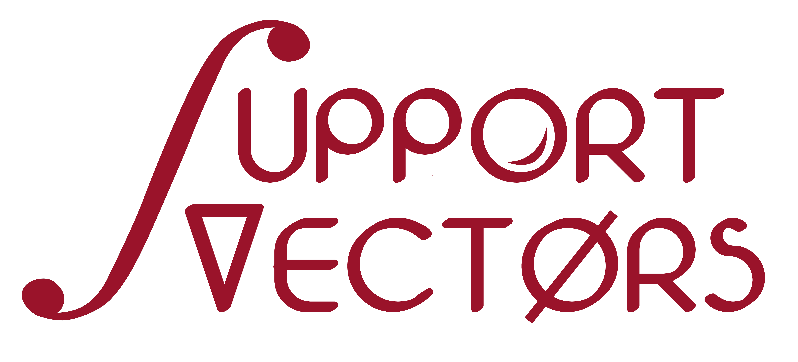

---

# Project Description

Educational notebooks and code that walk through **MemGraphRAG** concepts using the
[*Attention Is All You Need*](data/attention.pdf) paper as the corpus.

## Notebook sequence

1. `01_memgraphrag_overview` — framework motivation and three-layer memory
2. `02_document_ingestion` — load and chunk `attention.pdf`
3. `03_knowledge_extraction` — LLM schema and fact extraction
4. `04_three_layer_memory` — schema filtering and conflict resolution
5. `05_memory_graph` — build the heterogeneous indexing graph
6. `06_adjacency_matrix_ppr` — adjacency matrix, transition matrix, and PPR
7. `07_memory_guided_qa` — retrieval-grounded question answering

Supporting implementation lives in `src/memg_concepts`.
